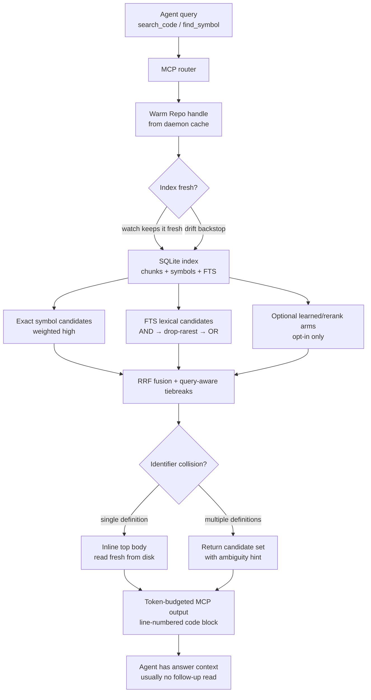
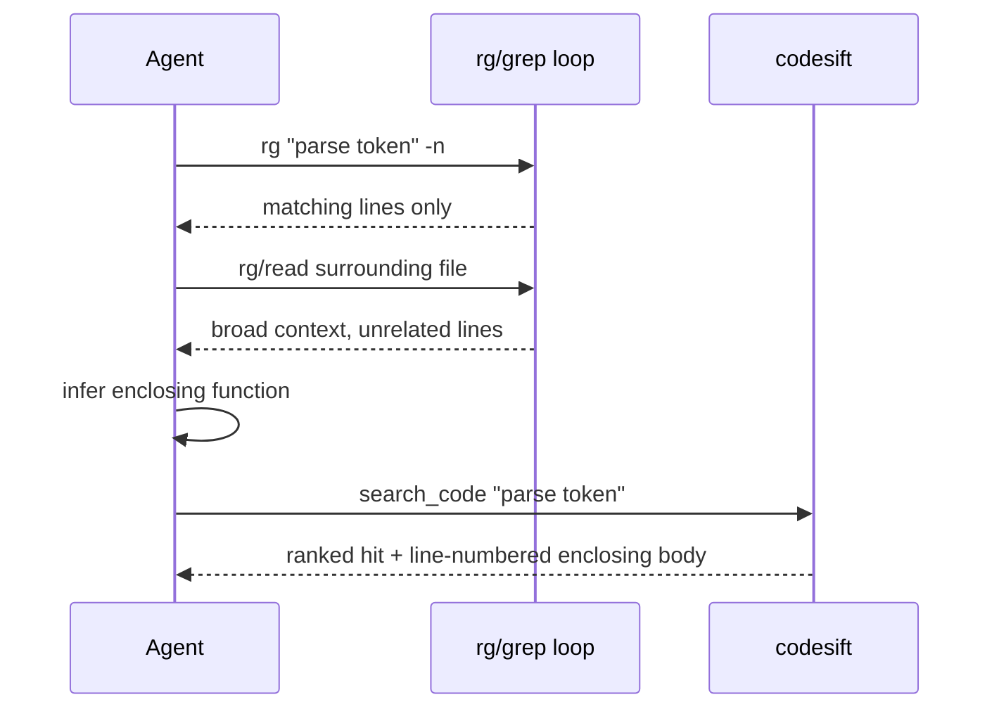

# codesift moat: one-call structural context

This document explains the recent moat work: how codesift turns a code-search query into paste-ready context in one tool call, and why that is more efficient than a raw `rg`/`grep` loop for AI coding agents.

## Goal

The moat is not "better string matching." `rg` is already excellent for exact text. The moat is **structural resolution with low context cost**:

1. **Fewer calls** — return the complete top answer inline so the agent usually does not need `read_chunk`.
2. **Fewer wasted tokens** — spend the budget on the relevant function/body, not unrelated grep context.
3. **More accurate context** — prefer definitions, symbols, signatures, and fresh disk reads over flattened match lines.
4. **Fresh by default** — keep the daemon's warm index updated while long agent sessions run.

## High-level flow

## What changed

### 1. `find_symbol` now resolves identifiers in one call

For exact symbol lookups, the old path returned only compact rows like `#1 function name file:line-range`, forcing a second `read_chunk` call. Now `find_symbol` attaches the top exact match's enclosing body when the lookup is unambiguous.

Policy:

- `withBody` defaults to `true`.
- Only the top exact match gets a body.
- Bodies are attached only when there are at most three exact rows; broader collisions remain compact.
- The body is read fresh from disk via `readRange`, then capped, dedented, and blank-collapsed.
- Disk/cap failures fall back to compact output instead of throwing.

### 2. `search_code` returns a useful top body, not just a teaser

The search path now builds compact candidates from the index, then reads the top result's full enclosing chunk from disk when the token budget allows. Rank 2 can also inline when it is close enough to rank 1; the tail stays compact for disambiguation.

This keeps output useful without letting one large body starve the whole response.

### 3. Ambiguous identifiers are honest

For a single-token identifier that maps to multiple definitions, auto `single_best` does **not** silently choose one. Instead, codesift returns a capped candidate set and adds an `ambiguous: N defs` hint. An explicit caller override can still force `singleBest`.

### 4. Lexical recall widens only when strict search under-recovers

The FTS ladder is progressive:

1. **Full AND**: every query concept term must match.
2. **Drop-rarest**: if AND returns fewer than the minimum target rows, drop the highest-IDF term group.
3. **Full OR**: final recall backstop.

Relaxation is disabled for symbol-dominated queries, so exact identifier searches do not drift toward unrelated subword matches.

### 5. The daemon keeps indexes fresh

The CLI MCP shim reuses a long-lived daemon. On first repo open, the daemon starts `Repo.watch()` in the background and stores the stop handle for shutdown. That gives warm handles plus automatic incremental syncs during long agent sessions.

If watch setup fails, queries still work; stale-hit annotations remain as the backstop.

## Why this is efficient

`rg` is fast, but it is line-oriented. The agent often needs extra calls to find the enclosing definition, read enough context, and disambiguate similarly named matches. codesift spends a small local-index lookup to return the structurally relevant body directly.

Efficiency comes from these mechanics:

- **Warm local index**: SQLite + daemon cache avoids repeated cold repo setup.
- **Structural chunks**: scanners index functions/classes/sections, so hits map to useful code boundaries.
- **Fresh body read**: the returned body comes from disk at response time, not a stale stored teaser.
- **Token caps**: inline bodies are capped by line and token limits; remaining hits stay compact.
- **Line-numbered output**: MCP renderers preserve indentation and add `NN |` prefixes for immediate editing.
- **No default network dependency**: learned embeddings/rerankers are opt-in; local lexical flows remain zero-egress.

## Response contract

- Use `find_symbol` for exact identifiers and definitions.
- Use `search_code` for behavior/concept queries.
- Expect the top result to include enough body context for the common case.
- Use `read_chunk` only when expanding additional hits or widening context beyond the inlined body.
- Treat `ambiguous: N defs` as a signal to choose among candidates instead of trusting rank 1 blindly.

## Current limits

- The default semantic/vector arm is still not a learned local model; cloud providers are opt-in.
- Usage bundling is opt-in and scoped to import-resolved/local TS/JS + Python cases.
- Very large bodies are intentionally truncated to preserve response budgets.
- The moat is strongest for "where/how is this implemented?" and exact symbol workflows; raw `rg` remains the right fallback for broad literal audits.
